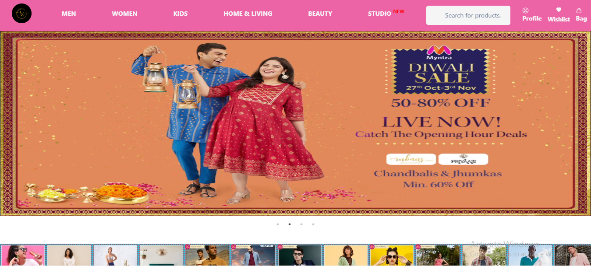
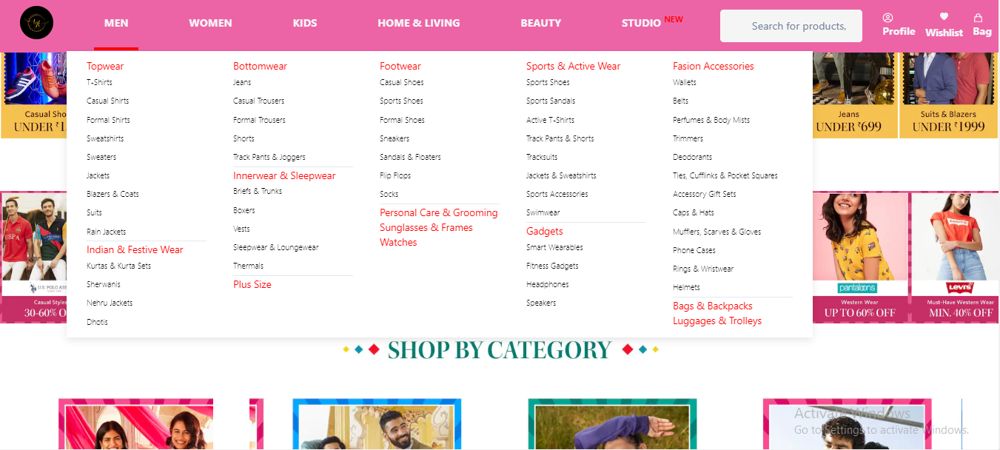
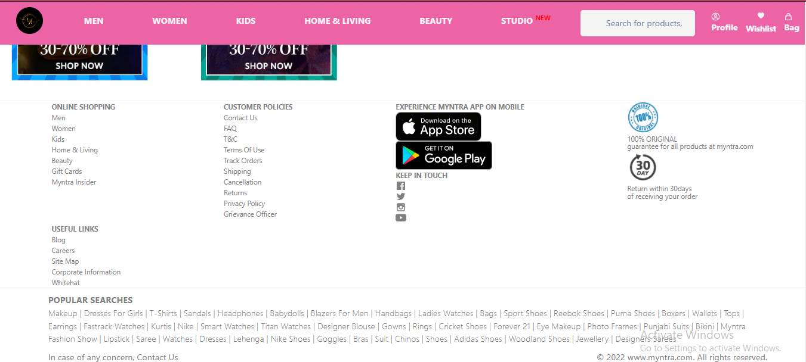
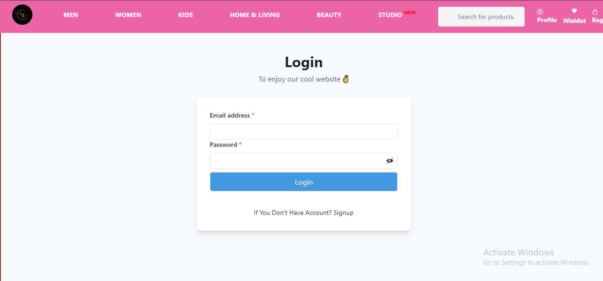
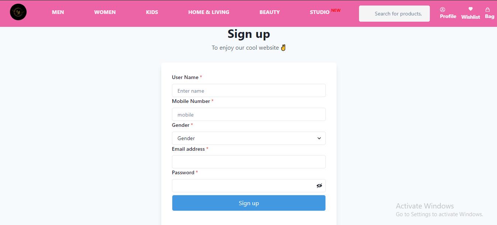
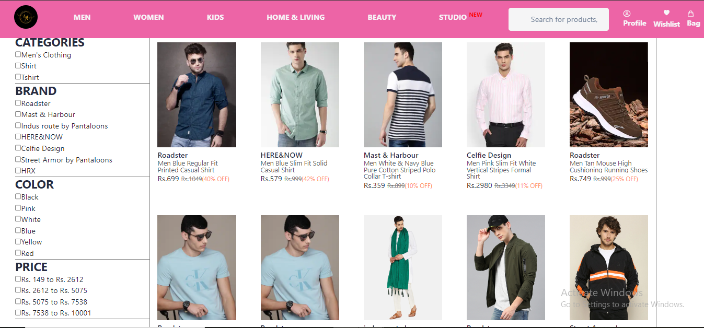
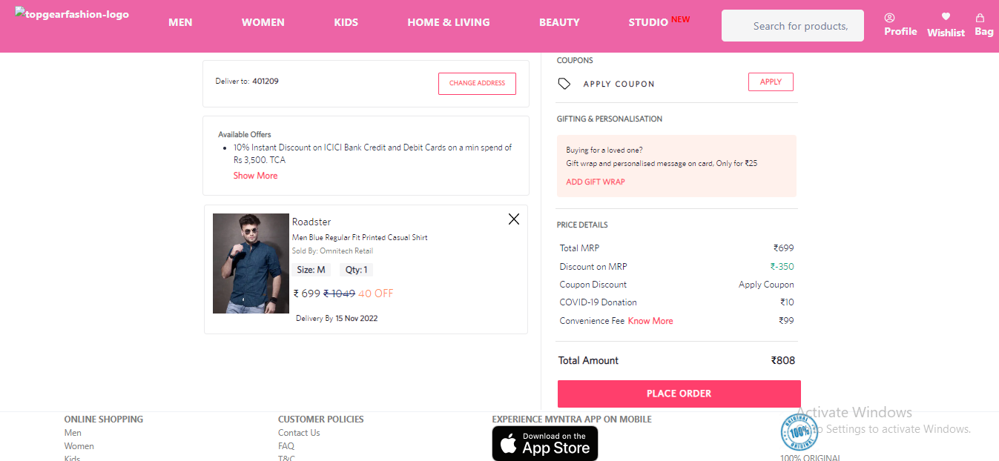

# TopGearFashion

 
This is a collaborative project. We cloned the online website of TopGearFashion and added the functionality like Signup, Login, Form validation,mens and womens page, payment page. we used HTML, CSS, JavaScript, React, Redux, ChakraUI, MongoDB, Mongoose and Render to built this project.

<h2>Url:- https://topgearfashion.vercel.app/</h2>

<h2>Github Source:- https://github.com/akashbhoi2815/common-meeting-175</h2>

<b>This is a team project by Masai school build in a week</b>
<h2>We are the team of 4 Members</h2>
    <ul>
        <li>Akash bhoi</li>
        <li>Bhrugu Prasad</li>
        <li>Harish Rayala</li>
        <li>Ravinder Saini</li>
    </ul>
<h2>Tech stack used to build this project</h2>
    <ul>
        <li>Html</li>
        <li>CSS</li>
        <li>JavaScript</li>
        <li>React-js</li>
        <li>Chakra-ui</li>
        <li>Redux/React-redux</li>
        <li>Mongo-DB</li>
        <li>Render</li>
        <li>Heroku</li>
    </ul>

## Home Page-1

## Home Page-2

## Footer

## Login Page

## Register

## Mens Page

## Womens Page

## Place Order

## Address

 
